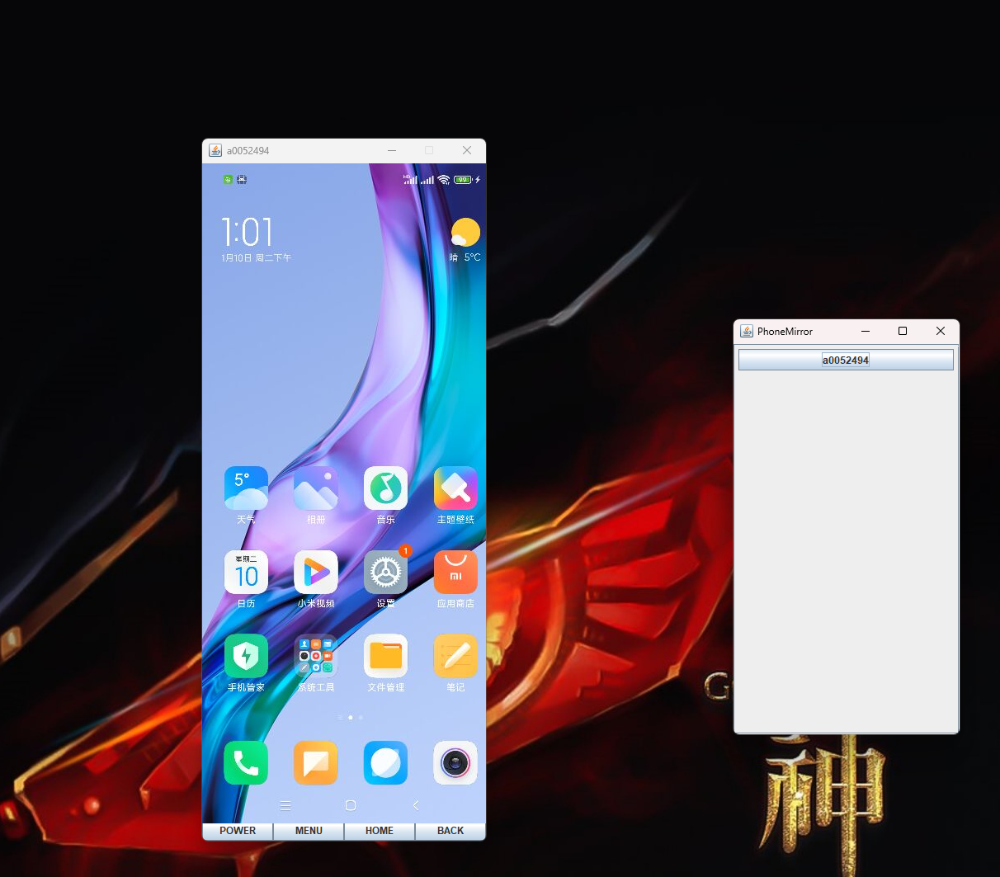

# README.md
***************************************
# phone-mirror-update
本项目是在对`huanglqweiwei`的phone-mirror(https://github.com/huanglqweiwei/PhoneMirror)进行修改之后重新编译的，弥补了原版无法对安卓9以上的手机控制的缺陷，最低支持java6，可同时控制多台手机

## 使用图片

## 使用方法
* 手机连接电脑，并开启`开发者选项->USB调试`；
> 注意：
> 小米手机需要同时开启`USB调试（安全设置）`才能处理点击事件。
* 运行项目目录下的`phone-mirror.jar`
```
java -jar ./phone-mirror.jar
```
## 说明
* 手机画面同步使用了[minicap](https://github.com/openstf/minicap)库；
* 点击事件处理使用项目目录下的android工程`TouchServer`。
